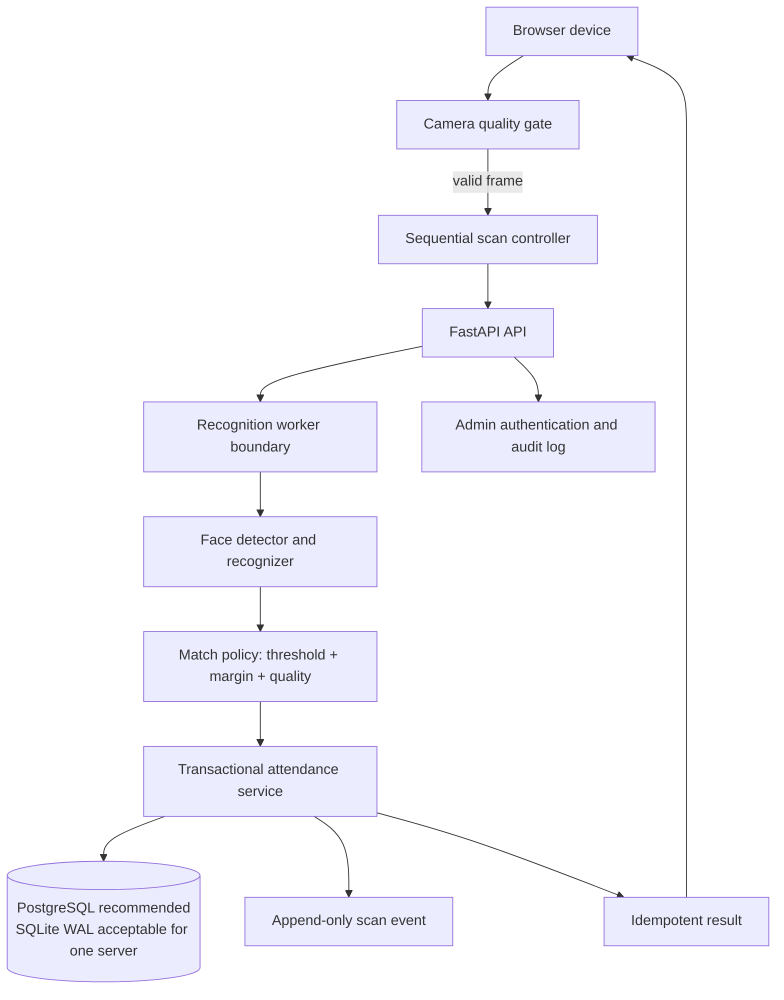
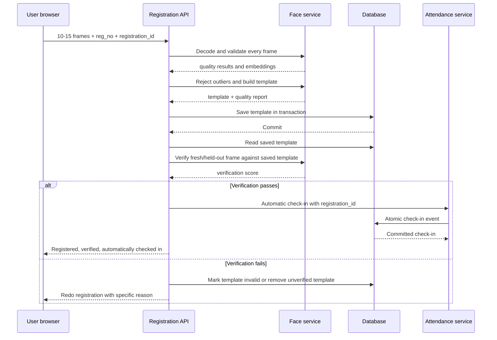

# Attendance System: Proposed Production Architecture

## 1. Purpose

This document proposes a reliable architecture for face registration and face-based check-in/check-out on 10-20 devices operating concurrently. It addresses the current risks found in `main.py`, `db.py`, `face_handler.py`, `static/app.js`, and `static/admin.js`.

The design preserves the existing requirement that registration automatically checks the student in. Automatic check-in is performed only after registration has passed quality validation, embedding consistency checks, database persistence verification, and a final identity verification.

## 2. Current System Summary

The current flow is:

```text
Browser camera
    -> base64 JPEG
    -> POST /api/register or /api/attendance/face
    -> shared FaceHandler
    -> SQLite read/update
    -> browser response
```

Registration currently captures ten frames, sends them to `/api/register`, averages every successfully extracted embedding, saves the result, and immediately calls `db.log_attendance()`.

Attendance captures a frame every 1.5 seconds, sends it to `/api/attendance/face`, compares it against every stored embedding, and writes into one daily row per student.

## 3. Confirmed Problems

### 3.1 Concurrent browser requests

`setInterval(captureKioskFace, 1500)` starts a new capture without waiting for the previous request. Recognition, network latency, confirmation dialogs, and SQLite writes can overlap.

Consequences:

- Multiple requests can act on the same student at once.
- A check-in response can arrive after a later check-out response.
- Confirmation requests can compete with normal interval requests.
- The same face can be accepted repeatedly by different devices.

### 3.2 Non-atomic attendance state changes

`db.log_attendance()` reads a daily row, decides which column to fill, and writes later. Two requests can read the same old state and make conflicting decisions.

The daily row model also cannot represent the original scan event, device, confidence, request ID, or correction history.

### 3.3 Process-local cooldown

`recent_scans` is a Python dictionary. It is not durable, is not shared across multiple Uvicorn workers, and applies globally to all devices connected to one process. It is also updated before the database write succeeds.

### 3.4 Shared mutable OpenCV detector

The singleton `FaceHandler` changes the detector input size on each request. Concurrent requests share mutable OpenCV model state. The recognition service should either serialize detector access or create independent model instances per worker/thread.

### 3.5 Weak face quality validation

A face detector score is not an image-quality score. The current implementation does not reject blur, poor lighting, small faces, extreme pose, occlusion, multiple faces, or inconsistent frames.

### 3.6 Unsafe registration averaging

All accepted embeddings are averaged. A wrong face, a side profile, or a low-quality frame can permanently weaken the stored template.

### 3.7 No persistence verification

The system reports registration success after writing the embedding. It does not reread the stored vector and verify that a fresh frame matches it.

### 3.8 Ambiguous matching threshold

The current face match threshold is `0.40`. There is no configurable threshold, top-1 versus top-2 margin, or backend-enforced policy. Detector confidence and recognition similarity are different measurements.

### 3.9 Camera readiness and diagnostics

The browser checks that `getUserMedia()` returned a stream but does not wait for a valid video frame. Camera errors are reduced to a generic message and do not distinguish permission, unavailable device, insecure origin, low resolution, or camera-in-use conditions.

### 3.10 Operational and security blockers

The supplied log shows `ModuleNotFoundError: No module named 'reportlab'`. The code also expects ONNX files under `models/`, but that directory is not present in the inspected workspace. Relative paths depend on the server's working directory.

The public API currently exposes high-impact operations without adequate authentication, uses wildcard CORS, and contains hardcoded administrator credentials/tokens.

## 4. Target Architecture



### 4.1 Components

1. **Browser camera controller**
   - Waits for `video.readyState >= 2` and non-zero dimensions.
   - Captures sequentially, never with overlapping requests.
   - Sends a unique `device_id` and `scan_id` with every request.
   - Stops scanning while a confirmation prompt is open.
   - Shows camera, quality, recognition, and attendance states separately.

2. **FastAPI request layer**
   - Validates image size, MIME/data URL format, mode, request ID, and payload limits.
   - Rejects invalid modes instead of silently treating them as auto mode.
   - Applies the server-side confidence policy.
   - Adds structured request logging and correlation IDs.

3. **Recognition service**
   - Performs image decoding, face quality checks, alignment, embedding, matching, and response generation.
   - Uses an immutable snapshot of registered templates for each match operation.
   - Serializes access to a shared OpenCV model or uses one model instance per worker.
   - Returns reason codes such as `NO_FACE`, `MULTIPLE_FACES`, `BLURRY`, `LOW_LIGHT`, `LOW_CONFIDENCE`, and `AMBIGUOUS_MATCH`.

4. **Attendance service**
   - Performs the state transition in one database transaction.
   - Uses an idempotency key so retries cannot create duplicate events.
   - Records the device, score, server timestamp, selected mode, and resulting action.
   - Reads the authoritative result from the committed transaction.

5. **Database**
   - Stores student identity and face templates separately from attendance events.
   - Uses constraints and indexes for concurrent access.
   - Stores server time in UTC and converts it for display.

6. **Admin and monitoring**
   - Uses real authentication and rotated credentials.
   - Provides threshold configuration, device status, failed-scan counts, lock errors, and audit history.

## 5. Registration Flow



### 5.1 Capture requirements

Capture 10 frames over 5-8 seconds, but do not blindly accept all frames. For each frame:

- Exactly one face must be detected.
- Face bounding box must be large enough, for example at least 15% of image width and height according to camera testing.
- Face must be inside the camera guide with adequate margins.
- Blur must be below the configured blur limit using a variance-of-Laplacian or equivalent metric.
- Brightness must be within a calibrated range; reject near-black and overexposed frames.
- Required landmarks must be present and plausible.
- Yaw, pitch, and roll must be within configured limits.
- Image dimensions and JPEG size must meet minimums.
- Frames must not all be near-duplicates.

The quality limits must be configurable and calibrated using the actual cameras. They should not be assumed to work equally on every phone or laptop.

### 5.2 Template construction

1. Discard failed-quality frames.
2. Require a minimum number of valid frames, such as 5.
3. Calculate pairwise cosine similarity between valid embeddings.
4. Find the dominant cluster.
5. Reject outliers instead of averaging them.
6. Average only the dominant cluster and normalize the result.
7. Store quality statistics, frame count, model version, and creation time.

A registration must fail with a redo message when valid frames are too few or mutually inconsistent.

### 5.3 Verification before automatic check-in

After saving, reread the exact stored template from the database. Verify at least one held-out frame or ask the user to hold their face for a short verification capture.

The verification must pass all of the following:

- Image quality gate passes.
- Exactly one face is detected.
- Recognition score is at least the configured registration verification threshold.
- The score is sufficiently above the second-best registered student, if comparing globally.
- The saved template can be decoded and has the expected vector length.

Only then call the existing automatic check-in operation. If check-in fails, return a distinct result such as `registered_but_check_in_failed`; do not claim full success.

## 6. Attendance Scan Flow

### 6.1 Browser behavior

Replace the interval loop with a sequential loop:

```text
start scanning
    -> wait for usable video frame
    -> capture frame
    -> send request
    -> await response
    -> display result
    -> wait cooldown/backoff
    -> capture next frame
```

Required client states:

- `camera_unavailable`
- `camera_not_ready`
- `capturing`
- `analyzing`
- `quality_retry`
- `face_not_recognized`
- `confirmation_required`
- `attendance_committed`
- `attendance_already_recorded`
- `network_error`

When confirmation is required, pause the scan loop. The confirmation request must reuse the same `scan_id`, and a cancelled or expired confirmation must not leave scanning in a stuck state.

### 6.2 Server recognition policy

The server should expose a policy object, for example:

```text
recognition_enabled = true
minimum_match_score = 0.60
minimum_match_margin = 0.05
minimum_detector_score = 0.85
require_quality_gate = true
```

The 60% value is an operational starting point, not a universal truth. SFace cosine scores must be calibrated with genuine and impostor samples from the intended cameras. A score of 0.60 should be enabled only after measuring false accepts and false rejects.

The backend must enforce the threshold. The UI toggle is a control for selecting an authorized policy, not a security boundary.

For each scan:

1. Decode and validate the image.
2. Run quality checks.
3. Detect exactly one face.
4. Extract and normalize the embedding.
5. Find the best and second-best candidate.
6. Require `best_score >= minimum_match_score`.
7. Require `best_score - second_score >= minimum_match_margin`.
8. Create an idempotent attendance command.
9. Commit the event and state transition transactionally.
10. Return the committed record and score.

## 7. Attendance Data Model

### 7.1 Recommended PostgreSQL schema

```sql
CREATE TABLE students (
    id BIGSERIAL PRIMARY KEY,
    reg_no TEXT NOT NULL UNIQUE,
    name TEXT NOT NULL DEFAULT '',
    department TEXT NOT NULL DEFAULT '',
    phone TEXT NOT NULL DEFAULT '',
    shift TEXT NOT NULL DEFAULT '',
    active BOOLEAN NOT NULL DEFAULT TRUE,
    created_at TIMESTAMPTZ NOT NULL DEFAULT now(),
    updated_at TIMESTAMPTZ NOT NULL DEFAULT now()
);

CREATE TABLE face_templates (
    id BIGSERIAL PRIMARY KEY,
    student_id BIGINT NOT NULL REFERENCES students(id) ON DELETE CASCADE,
    embedding JSONB NOT NULL,
    model_name TEXT NOT NULL,
    model_version TEXT NOT NULL,
    quality_summary JSONB NOT NULL,
    is_verified BOOLEAN NOT NULL DEFAULT FALSE,
    created_at TIMESTAMPTZ NOT NULL DEFAULT now()
);

CREATE TABLE scan_events (
    id BIGSERIAL PRIMARY KEY,
    scan_id UUID NOT NULL UNIQUE,
    student_id BIGINT REFERENCES students(id),
    device_id TEXT NOT NULL,
    requested_mode TEXT NOT NULL CHECK (requested_mode IN ('check_in', 'check_out', 'auto')),
    action TEXT,
    score DOUBLE PRECISION,
    detector_score DOUBLE PRECISION,
    status TEXT NOT NULL,
    reason_code TEXT,
    server_time TIMESTAMPTZ NOT NULL DEFAULT now(),
    metadata JSONB NOT NULL DEFAULT '{}'
);

CREATE TABLE attendance_days (
    student_id BIGINT NOT NULL REFERENCES students(id) ON DELETE CASCADE,
    attendance_date DATE NOT NULL,
    s1_in TIMESTAMPTZ,
    s1_out TIMESTAMPTZ,
    s2_in TIMESTAMPTZ,
    s2_out TIMESTAMPTZ,
    status TEXT NOT NULL DEFAULT 'INCOMPLETE',
    version INTEGER NOT NULL DEFAULT 0,
    PRIMARY KEY (student_id, attendance_date)
);
```

`scan_events` is the audit trail. `attendance_days` is the convenient current summary. The event is written first or in the same transaction as the summary update, so every summary change has an explanation.

### 7.2 SQLite alternative

If PostgreSQL cannot be introduced immediately:

- Enable `PRAGMA journal_mode=WAL`.
- Set `PRAGMA busy_timeout=10000` on every connection.
- Use one connection per request and always close it with `try/finally`.
- Use `BEGIN IMMEDIATE` around attendance state transitions.
- Add an append-only `scan_events` table.
- Add a unique `scan_id` constraint.
- Add indexes on attendance date and student.
- Serialize access to the shared attendance transition if load testing shows lock contention.
- Run one application process until multi-process behavior is explicitly tested.

SQLite WAL can support this workload when writes are short and controlled, but PostgreSQL is the stronger long-term choice for many devices and future deployments.

## 8. Atomic Attendance Transition

The attendance service should use this pattern:

```text
BEGIN transaction
    INSERT scan_events(scan_id, device_id, ...) ON CONFLICT(scan_id) return existing result

    SELECT attendance_days
    WHERE student_id = ? AND date = ?
    FOR UPDATE                         -- PostgreSQL

    Determine valid transition from requested mode and session state
    Update exactly one attendance column, or record already-complete state
    Increment version
    Update summary status
    Update scan_events with action, score, and result
COMMIT
```

For SQLite, replace row locking with `BEGIN IMMEDIATE` and a short transaction. Do not perform face matching, email sending, or image encoding while holding the database transaction.

A failed transaction must rollback and must not consume the cooldown or report success.

## 9. Cooldown and Duplicate Protection

Use three separate protections:

1. **Client pacing**: prevent overlapping requests from one browser.
2. **Idempotency**: the same `scan_id` returns the original result on retries.
3. **Server duplicate policy**: reject or mark repeated scans for the same student/action within a configured window.

The duplicate policy belongs in the database or shared cache, not only in a Python dictionary. Redis is appropriate if multiple API workers are used. The stored key should include student, action/session, and time policy, not just student.

A cooldown should be created only after a successful committed action, or the response should explicitly distinguish `already_recorded` from `cooldown`.

## 10. Device and Request Identity

Each browser installation should generate and persist a random `device_id` in local storage. Each capture generates a random `scan_id`.

The server should record:

- `device_id`
- `scan_id`
- request received time
- server commit time
- requested mode
- matched registration number
- match score and margin
- detector score
- result code
- application version

This makes it possible to prove whether an event came from the expected device and to diagnose apparent cross-device mismatches.

A device ID is for diagnostics and idempotency context, not authentication. Device authentication should use a proper enrollment token if the kiosk needs to be trusted.

## 11. UI Proposal

### 11.1 Confidence toggle

Add a segmented control or toggle with a clear server-backed policy:

- `Standard`: calibrated production threshold
- `Strict 60%+`: minimum recognition score 0.60 plus margin rule

Display the active policy and the actual score after a match. The client must never be allowed to lower the server's minimum.

For a simple first release, use a checkbox labeled `Require 60%+ confidence` and send the requested policy name, not an arbitrary numeric threshold. The server maps that name to approved values.

### 11.2 Registration quality panel

During capture show:

- camera status
- face detected/not detected
- one face required
- lighting status
- sharpness status
- face size status
- pose status
- valid frame count
- progress

At completion show either:

```text
Registration verified
Face template saved
Verification: 78%
Automatic check-in completed
```

or:

```text
Registration not saved
5 of 10 frames were usable, but the face changed too much between frames.
Please redo in better light and keep one face centered.
```

### 11.3 Attendance result panel

Show the server's committed result, not local browser time or stale response data:

- student name and registration number
- check-in/check-out action
- server timestamp
- match confidence
- quality result
- device/request diagnostic ID where appropriate

## 12. API Contract

### `POST /api/register`

Request:

```json
{
  "registration_id": "uuid",
  "reg_no": "FY-2026-001",
  "images": ["data:image/jpeg;base64,..."],
  "verification_image": "data:image/jpeg;base64,...",
  "auto_check_in": true
}
```

Success:

```json
{
  "status": "success",
  "registration_verified": true,
  "auto_check_in": "success",
  "frames_received": 10,
  "frames_accepted": 8,
  "verification_confidence": 0.78,
  "quality_summary": {}
}
```

Failure should use stable reason codes:

```json
{
  "status": "redo_required",
  "code": "INCONSISTENT_EMBEDDINGS",
  "message": "The captured face changed too much. Please keep your face centered and try again.",
  "frames_received": 10,
  "frames_accepted": 3
}
```

### `POST /api/attendance/face`

Request:

```json
{
  "scan_id": "uuid",
  "device_id": "device-uuid",
  "image": "data:image/jpeg;base64,...",
  "mode": "check_in",
  "policy": "strict_60",
  "confirm": false
}
```

Success:

```json
{
  "status": "success",
  "scan_id": "uuid",
  "reg_no": "FY-2026-001",
  "confidence": 0.74,
  "margin": 0.18,
  "action": "s1_in",
  "server_time": "2026-08-22T09:30:00Z",
  "data": {}
}
```

Do not return success until the database transaction has committed.

## 13. Error and Recovery Policy

- `400`: malformed request, invalid mode, invalid image, or quality failure.
- `404`: no recognized face, with a stable reason code.
- `409`: duplicate request or invalid attendance transition.
- `412`: confidence or quality policy not satisfied.
- `423`: temporary database contention after bounded retries.
- `429`: shared duplicate/cooldown policy.
- `500`: unexpected server failure, logged with correlation ID.

The browser should retry network failures with the same `scan_id`, but must not blindly retry a request after an unknown server response using a new ID.

## 14. Security and Deployment Requirements

Before production use:

- Create a `requirements.txt` or `pyproject.toml` containing FastAPI, Uvicorn, OpenCV, NumPy, ReportLab, Pydantic, and dotenv dependencies.
- Package or validate the two ONNX model files at startup with clear diagnostics.
- Resolve database, static, certificate, and model paths from the application directory or environment variables.
- Replace hardcoded admin credentials and bearer tokens.
- Protect registration, CSV import, manual edits, and session controls.
- Restrict CORS to known origins.
- Add upload size and CSV validation limits.
- Do not expose private face embeddings in ordinary API responses.
- Use HTTPS with a trusted certificate for camera access on the LAN.
- Configure process count deliberately. Do not use multiple workers with in-memory cooldowns or shared mutable model state.
- Add structured logs and health metrics.

The `reportlab` startup failure must be corrected before any API validation is meaningful. Install the dependency in the deployment environment and document the exact start command.

## 15. Testing Strategy

### 15.1 Unit tests

Test:

- image decoding and malformed base64
- quality metrics at boundary values
- one face, zero faces, and multiple faces
- embedding normalization and invalid vector lengths
- outlier rejection and cluster consistency
- score threshold and top-2 margin policy
- all attendance state transitions
- invalid mode rejection
- idempotent repeated `scan_id`
- transaction rollback behavior
- automatic check-in only after verification
- registration failure leaves no valid face template and no attendance record

### 15.2 Integration tests

Use a temporary database and mocked face service to test:

- successful registration plus automatic check-in
- failed verification with no automatic check-in
- successful check-in response contains committed database values
- simultaneous check-in requests for one student
- simultaneous check-in requests for different students
- simultaneous check-in and check-out requests
- confirmation flow pause and retry
- database lock retry and bounded failure

### 15.3 Load and device tests

Run at least:

- 20 devices, 1 request per device every 2 seconds
- 20 devices scanning different students
- multiple devices scanning the same student
- mixed check-in and check-out traffic
- slow network responses
- one server process and the planned production worker count
- 30-60 minutes of sustained activity

Acceptance criteria:

- zero cross-student attendance assignments
- zero duplicate committed events for one `scan_id`
- no lost committed check-ins
- no unexplained daily-row transitions
- no unbounded `database is locked` errors
- p95 recognition/API response time within the chosen operational target
- failed scans never create attendance records
- automatic registration check-in occurs only after verification success

## 16. Recommended Implementation Order

### Phase 0: Make the environment runnable

1. Add dependency manifest including ReportLab.
2. Install and verify Python dependencies.
3. Package/check ONNX models.
4. Fix application-root-relative paths.
5. Add a startup health check.

### Phase 1: Correctness fixes

1. Validate request modes and image payloads.
2. Fix connection cleanup and rollback handling.
3. Enable SQLite WAL and busy timeout if remaining on SQLite.
4. Add database transactions for attendance transitions.
5. Add client in-flight protection and pause during confirmation.
6. Return `currentData` consistently in the UI.
7. Move cooldown/duplicate protection to durable shared storage.

### Phase 2: Face quality and verification

1. Add quality metrics and stable reason codes.
2. Require exactly one face.
3. Reject inconsistent registration embeddings.
4. Persist quality metadata and model version.
5. Reread and verify the saved template.
6. Trigger automatic check-in only after verification succeeds.

### Phase 3: Auditability and multi-device operation

1. Add `scan_events` and `scan_id` idempotency.
2. Add device IDs and structured logs.
3. Add confidence threshold and margin policy.
4. Add confidence toggle backed by server policy.
5. Add load and race-condition tests.

### Phase 4: Production hardening

5. Perform a supervised pilot before relying on attendance records.

## 17. Final Recommendation

For an immediate 10-20-device deployment, use one FastAPI process, SQLite WAL with short `BEGIN IMMEDIATE` transactions, sequential browser scanning, durable idempotency, and an append-only event table. This is the smallest reliable correction.

For a production attendance system with multiple server workers, future sites, or high audit requirements, use PostgreSQL, a shared cache for duplicate policy, independent recognition workers, and authenticated devices.

The non-negotiable rule is:

```text
No valid face-quality result + no verified identity + no committed transaction = no attendance record.
```

Automatic check-in remains part of registration, but only after the saved face template has been successfully verified.
